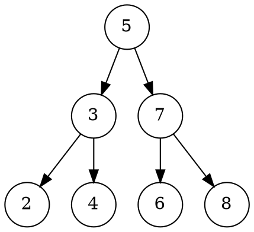

# Интеграция MCP серверов в процесс обучения

## 🎯 Цель
Использование MCP (Model Context Protocol) серверов для автоматизации задач и улучшения процесса обучения деревьям.

## 📦 Установленные серверы

### 1. LeetCode MCP Server
**Пакет**: `@jinzcdev/leetcode-mcp-server`

**Использование в обучении**:
- Получение задач по тегам: "trees", "binary-tree", "binary-search-tree"
- Проверка решений без переключения в браузер
- Получение примеров тест-кейсов
- Автоматическое обновление прогресса в `practice/leetcode/README.md`

**Примеры команд для AI**:
- "Получи задачу Validate Binary Search Tree"
- "Проверь моё решение задачи 98"
- "Дай примеры входных данных для задачи 230"

### 2. Graphviz
**Установлен**: через Homebrew (версия 14.1.1)

**Использование в обучении**:
- Автоматическая генерация визуализаций деревьев
- Создание диаграмм для notes.md
- Визуализация операций (вставка, удаление, повороты)
- Демонстрация обходов дерева

**Как использовать**:
Graphviz используется **напрямую через команду `dot`** в терминале. AI может выполнять команды для генерации изображений.

**Примеры использования**:
- "Создай визуализацию этого BST: [5, 3, 7, 2, 4, 6, 8]"
- "Покажи поворот в AVL дереве"
- "Визуализируй обход in-order этого дерева"

**Команда для AI**:
```bash
# AI может выполнять команды типа:
echo 'digraph BST {
    node [shape=circle];
    5 -> 3;
    5 -> 7;
    3 -> 2;
    3 -> 4;
}' | dot -Tpng -o tree.png
```

---

## 🔄 Интеграция с правилами обучения

### При объяснении концепций

**Без MCP**:
```
AI: "Вот ASCII-визуализация дерева:
       5
      / \
     3   7
```

**С MCP (Graphviz)**:
```
AI: [Генерирует DOT-код и создаёт PNG изображение]
AI: "Вот визуализация дерева: [вставляет изображение]"
```

### При решении задач LeetCode

**Без MCP**:
```
Ученик: "Помоги решить Validate Binary Search Tree"
AI: "Откройте LeetCode и найдите задачу 98..."
```

**С MCP (LeetCode)**:
```
Ученик: "Помоги решить Validate Binary Search Tree"
AI: [Получает задачу через MCP]
AI: "Вот условие задачи: [показывает из MCP]
     Примеры: [показывает из MCP]
     Давайте разберём подход..."
```

---

## 📋 Обновление правил для AI

### Новые возможности с MCP

1. **Автоматическая визуализация**:
   - При объяснении новой структуры данных
   - При демонстрации операций
   - При показе обходов

2. **Интеграция с LeetCode**:
   - Получение задач без ручного поиска
   - Проверка решений локально
   - Автоматическое обновление прогресса

3. **Улучшенная обратная связь**:
   - Визуальное сравнение решений
   - Диаграммы для объяснения ошибок
   - Графики производительности

---

## 🎓 Примеры использования в модулях

### Модуль 2: Бинарные деревья

**Сценарий**: Изучение BST

1. AI объясняет концепцию BST
2. AI использует Graphviz для создания визуализации
3. AI получает задачу LeetCode через MCP
4. AI помогает решить задачу
5. AI обновляет прогресс в checklist.md

### Модуль 3: AVL деревья

**Сценарий**: Изучение поворотов

1. AI объясняет дисбаланс
2. AI генерирует визуализацию до/после поворота
3. AI показывает анимацию (через серию изображений)
4. AI получает задачу на AVL из LeetCode

---

## 💡 Рекомендации для AI

### Когда использовать Graphviz:
- ✅ При объяснении новой структуры данных
- ✅ При демонстрации операций (вставка, удаление)
- ✅ При показе обходов дерева
- ✅ При объяснении балансировки
- ✅ При сравнении разных структур

### Когда использовать LeetCode:
- ✅ При запросе задачи учеником
- ✅ При проверке решения
- ✅ При получении примеров тест-кейсов
- ✅ При обновлении прогресса
- ✅ При поиске похожих задач

---

## 🚫 Ограничения

1. **Graphviz**: Требует установленный Graphviz
2. **LeetCode**: Может требовать аутентификацию для некоторых функций
3. **Производительность**: Генерация изображений может занять время

---

## 🔧 Технические детали

### Формат DOT для деревьев



### Использование в коде

AI может генерировать DOT-код и сохранять его в файлы:
- `docs/visualizations/tree-001.dot`
- `docs/visualizations/tree-001.png`

---

**Примечание**: Эти возможности должны использоваться для улучшения обучения, а не заменять объяснения и направление ученика.

